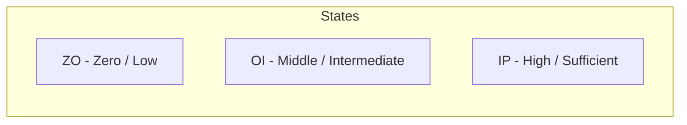

# Fuzzy Logic Inference System

**A fuzzy logic-based academic grade evaluation system built with C# WinForms. Uses membership functions, fuzzy inference rules, and defuzzification via the center-of-gravity method to compute final grades from midterm and final exam scores.**

## Features

- **Fuzzy Membership Functions**: Triangular membership functions for midterm and final exam scores with configurable thresholds (Min, Max)
- **Expert Rule Table**: 4×4 configurable matrix mapping (final × midterm) fuzzy states to letter grades (A, B, C, D, F)
- **Real-time Graph Rendering**: Membership functions and result graph drawn on picture boxes using GDI+
- **Center-of-Gravity Defuzzification**: Computes a crisp success score from fuzzy rule activations
- **Grade Output**: Displays numeric score and up to two letter grades based on the result

## Project Structure

```
fuzzy-logic-inference/
├── BulanikMantik_1.sln
├── BulanikMantik_1/
│   ├── Form1.cs              # Main form: UI, fuzzy system, graph rendering
│   ├── Form1.Designer.cs     # Designer-generated layout
│   ├── Program.cs            # Application entry point
│   └── Properties/
│       ├── AssemblyInfo.cs
│       ├── Resources.Designer.cs
│       └── Settings.Designer.cs
└── README.md
```

## System Architecture

```mermaid
flowchart TD
    subgraph Input
        A[Vize - Midterm Score]
        B[Final Score]
    end
    
    subgraph Fuzzification
        C[Membership Functions<br>ZO / OI / IP]
        D[Derece Hesapla<br>Compute degree of membership]
    end
    
    subgraph Inference
        E[Expert Rule Table<br>4×4 Matrix]
        F[Rule Activation<br>AND operation - min of degrees]
    end
    
    subgraph Defuzzification
        G[Moment Hesapla<br>Center of Gravity]
        H[Crisp Success Score]
    end
    
    subgraph Output
        I[Letter Grade<br>A/B/C/D/F(up to 2)]
    end
    
    A --> C
    B --> C
    C --> D
    D --> E
    E --> F
    D --> F
    F --> G
    G --> H
    H --> I
```

## Core Concepts

### Fuzzy Logic

Fuzzy logic extends classical Boolean logic to handle **partial truth** — values between 0 and 1. This system uses it to model the imprecise nature of academic grading.

### Membership Functions

Each input (midterm, final) is fuzzified into three linguistic states:



Each state is a **triangular membership function** defined by `Min` and `Max` thresholds:

- **ZO** (Low): Increases from 0→1 from score 0→Min, then decreases 1→0 from Min→(Min+Max)/2
- **OI** (Middle): Triangular shape centered at (Min+Max)/2, spanning from Min to Max
- **IP** (High): Increases from 0→1 from (Min+Max)/2→Max, then stays at 1 for scores > Max

```
Membership degree μ(x):

ZO: μ(x) = {  1 - x/Min             if x ≤ Min
            {  0                     if x > (Min+Max)/2
            {  ((Min+Max)/2 - x) / ((Min+Max)/2 - Min)  otherwise

OI: μ(x) = {  (x - Min) / ((Min+Max)/2 - Min)       if Min ≤ x ≤ (Min+Max)/2
            {  (Max - x) / (Max - (Min+Max)/2)       if (Min+Max)/2 ≤ x ≤ Max
            {  0                                     otherwise

IP: μ(x) = {  (x - (Min+Max)/2) / (Max - (Min+Max)/2)  if (Min+Max)/2 ≤ x ≤ Max
            {  1                                        if x > Max
            {  0                                        otherwise
```

### Expert Rule Table

A 4×4 grid maps fuzzy states of final (rows) × midterm (columns) to letter grades:

| Final \ Midterm | ZO | OI | IP | (overflow) |
|---|---|---|---|---|
| ZO | F | F/D | D | D |
| OI | F/D | D/C | C | C |
| IP | D | C/B | B | B |
| (overflow) | D | C/B | B | A |

Each row/column index corresponds to which fuzzy state the input falls into:
- **Index 0**: ZO region (left of Min)
- **Index 1**: OI region (between Min and midpoint)
- **Index 2**: IP region (between midpoint and Max)
- **Index 3**: Beyond Max (overflow region)

### Defuzzification — Center of Gravity

For each activated rule, the system:
1. Takes the **minimum degree** between the two contributing membership values (AND operation)
2. Draws a horizontal line at that degree across the result membership triangle for that grade
3. Computes the **area** and **moment** of the resulting trapezoid/polygon

The final crisp score is:
```
Success Score = Σ(moment) / Σ(area) / 3
```

This is the **centroid** (center of gravity) of the combined fuzzy output shape.

### Grade Assignment

The numeric score is mapped to up to two letter grades based on configurable A, B, C, D, F thresholds with a range (Ref) parameter:

| Grade | Condition |
|---|---|
| A | Score ≥ A - Ref |
| B | B - Ref ≤ Score < A |
| C | C - Ref ≤ Score < B |
| D | D - Ref ≤ Score < C |
| F | Score < F |

## How to Use

1. Run the application
2. Set midterm and final exam scores using the numeric up-down controls
3. Configure each exam's Min/Max thresholds for membership functions
4. Adjust the expert rule table (4×4 grid) with letter grades
5. Set the grade scale (A, B, C, D, F values and Ref range)
6. Membership graphs and the result graph update in real time
7. Read the numeric success score and assigned letter grade(s)

## Building

Open `BulanikMantik_1.sln` in Visual Studio 2008+ (retarget .NET Framework if needed) and build.
